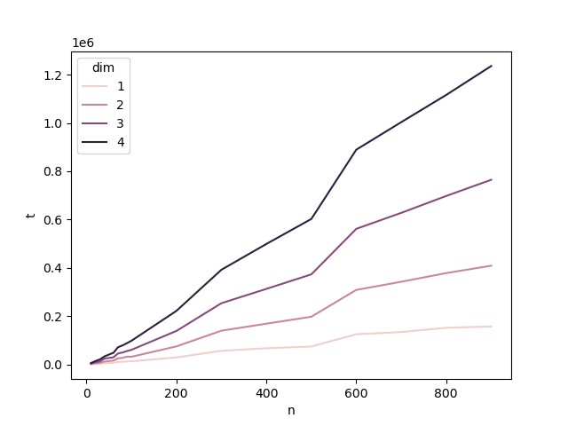

# Smallest Color-Spanning Square For Pairs Of Points

## Description

Computing the smallest color-spanning axis-parallel square for $n$ given pairs ($p_i$, $q_i$) of points where points $p_i$ and $q_i$ are colored with color $i$. 

Section 4 of paper [[1]](#1) used in this implementation to achieve  $O(n \log {n})$ computation complexity for 2D space. ($O(nd^2\log{n})$ for any $d$ dimensional space)

In this approach, first we reduce the problem to a 2-SAT problem and then we perform a binary search over the side length of the square on a sorted matrix to find the smallest length. This method only gives us the side length of the square. For computing the position of the square extra computations are needed.

## Algorithms
All algorithms implemented in c++ 
- Pick [[2]](#2); selecting $i$-th smallest number from a set of $n$ distinct numbers in $O(n)$. `pick.h pick.cpp`
- Select [[3]](#3); selecting $i$-th smallest number from an $m\times n$ sorted matrix in $O(m \log {2n \over m})$. `sorted_matrix.h sorted_matrix.cpp`
- 2-SAT; checking satisfiablity of a CNF consists of clauses with exactly 2 terms. `SAT2.h SAT2.cpp`
- Section 4 of [[1]](#1); finding smallest color-spanning square side length for given pair of points. `square.h square.cpp`

For validation every algorithm compared with brute-force version of itself and for time complexity they are tested on different input sizes. You can find timing results for each algorithm in analysis directory.

## Installation

- gcc/g++ (for make)
- python3 (for plotting results)

## Usage

### Linux
For running validation and timing tests on each implemented algorithms, run the command below. Timing results can be found in `analysis` directory.

    sh run.sh
For finding the side length of the smallest hypercube run the command below. $n$ is the number of random pairs to generate, $dim$ is the dimension of space. Results can be found in `result` directory.

    sh run.sh [n] [dim]
### Other OS
First you need to create two directories `result` and `analysis` alongside the source codes. Then compile c++ files (you can use `Makefile`). 

Run main file

    main
or   

    main [n] [dim]
for creating plots you need to run the python script aswell

    python plot.py

## Result
Timing result of proposed algorithm.

  

## License
MIT license

## Contribution

Any contribution is welcomed.

## References
<a id="1">[1]</a> 
Khanteimouri P, Mohades A, Abam MA, Kazemi MR, Sedighin S. E ciently computing the smallest axis-parallel squares spanning all colors.

<a id="2">[2]</a> 
Blum M, Floyd RW, Pratt VR, Rivest RL, Tarjan RE. Time bounds for selection. J. Comput. Syst. Sci.. 1973 Aug 1;7(4):448-61.

<a id="3">[3]</a> 
Frederickson GN, Johnson DB. Generalized selection and ranking: sorted matrices. SIAM Journal on computing. 1984 Feb;13(1):14-30.
